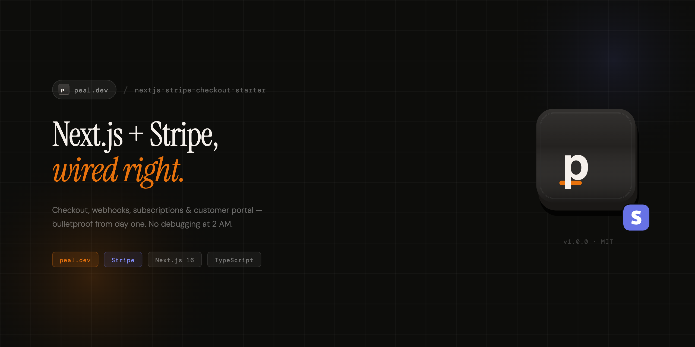

<p align="center">
  
</p>

<h1 align="center">Next.js Stripe Checkout Starter</h1>

<p align="center">
  A production-ready Next.js 16 template for accepting payments with Stripe.<br />
  One-time purchases, subscriptions, or both — configured in a single file.
</p>

<p align="center">
  
  
  
  
  
  
</p>

---

## Features

| | Feature | Description |
|---|---|---|
| **Payment Modes** | | |
| :credit_card: | One-time payments | Single-charge checkout with Stripe hosted page |
| :repeat: | Subscriptions | Recurring billing with monthly/yearly toggle |
| :zap: | Hybrid mode | Both one-time and subscriptions in the same app |
| :gear: | Single config file | Switch payment modes in `payments.config.ts` |
| **Checkout Flow** | | |
| :sparkles: | Animated pricing cards | Smooth price transitions with NumberFlow |
| :white_check_mark: | Success page | Order confirmation with line items, total, email |
| :x: | Cancel page | Reassurance UI with "no charges made" messaging |
| :bust_in_silhouette: | Customer Portal | Self-service billing management via Stripe |
| **Security** | | |
| :lock: | Webhook signature verification | HMAC-verified Stripe webhook handler |
| :shield: | CSP + HSTS headers | Content-Security-Policy with Stripe domains whitelisted |
| :no_entry: | Rate limiting | Upstash Redis sliding window on checkout creation |
| :mag: | Zod validation | Every external input validated at the boundary |
| :key: | Type-safe env vars | Build-time validation via @t3-oss/env-nextjs |
| **DX** | | |
| :brain: | TypeScript strict mode | Zero `any`, zero errors, `noUncheckedIndexedAccess` |
| :broom: | ESLint strict config | `strictTypeChecked` + zero warnings |
| :jigsaw: | shadcn/ui components | Beautiful, accessible UI primitives |
| :bone: | Skeleton loading states | Instant perceived performance on every page |
| :rotating_light: | Error boundaries | Graceful error handling per route segment |

## Tech Stack

| Category | Technology |
|---|---|
| Framework | [Next.js 16](https://nextjs.org) (App Router) |
| Language | [TypeScript](https://www.typescriptlang.org) (strict mode) |
| Styling | [Tailwind CSS 4](https://tailwindcss.com) |
| UI Components | [shadcn/ui](https://ui.shadcn.com) |
| Payments | [Stripe](https://stripe.com) (SDK v20 + Stripe.js v8) |
| Validation | [Zod](https://zod.dev) |
| Env Validation | [@t3-oss/env-nextjs](https://env.t3.gg) |
| Rate Limiting | [Upstash Redis](https://upstash.com) (optional) |
| Animations | [@number-flow/react](https://number-flow.barvian.me) |
| Linting | [ESLint 9](https://eslint.org) + [typescript-eslint](https://typescript-eslint.io) |

## Quick Start

### Prerequisites

- [Node.js](https://nodejs.org) 18.17+ (or [Bun](https://bun.sh))
- [Stripe account](https://dashboard.stripe.com/register) (free to create)
- [Stripe CLI](https://docs.stripe.com/stripe-cli) (for local webhook testing)

### 1. Clone and install

```bash
git clone https://github.com/your-username/nextjs-stripe-checkout-starter.git
cd nextjs-stripe-checkout-starter
bun install
```

### 2. Set up environment variables

```bash
cp .env.example .env.local
```

Open `.env.local` and fill in your Stripe keys:

```env
# Get these from https://dashboard.stripe.com/apikeys
STRIPE_SECRET_KEY=sk_test_...
NEXT_PUBLIC_STRIPE_PUBLISHABLE_KEY=pk_test_...

# Generated when you start the Stripe CLI listener (step 4)
STRIPE_WEBHOOK_SECRET=whsec_...
```

### 3. Configure your pricing

Edit `src/config/pricing.ts` and replace the placeholder price IDs with your actual [Stripe Price IDs](https://dashboard.stripe.com/prices):

```ts
{
  type: "recurring",
  id: "pro",
  name: "Pro",
  monthlyPriceId: "price_YOUR_MONTHLY_ID",
  yearlyPriceId: "price_YOUR_YEARLY_ID",
  monthlyPrice: 29,
  yearlyPrice: 290,
  // ...
}
```

### 4. Start the webhook listener

In a separate terminal:

```bash
stripe listen --forward-to localhost:3000/api/webhooks/stripe
```

Copy the webhook signing secret (`whsec_...`) it outputs into your `.env.local`.

### 5. Run the dev server

```bash
bun dev
```

Open [http://localhost:3000](http://localhost:3000) — you're ready to accept payments.

## Architecture

### Folder Structure

```
src/
├── app/
│   ├── (marketing)/              # Landing page, pricing
│   │   ├── pricing/
│   │   │   ├── page.tsx          # Pricing page
│   │   │   └── loading.tsx       # Skeleton UI
│   │   └── error.tsx             # Error boundary
│   ├── api/webhooks/stripe/
│   │   └── route.ts              # Webhook handler (ONLY API route)
│   ├── checkout/
│   │   ├── success/
│   │   │   ├── page.tsx          # Order confirmation
│   │   │   └── loading.tsx       # Skeleton UI
│   │   ├── cancel/page.tsx       # Cancellation page
│   │   └── error.tsx             # Error boundary
│   ├── layout.tsx                # Root layout
│   ├── loading.tsx               # Global loading fallback
│   ├── error.tsx                 # Global error boundary
│   └── not-found.tsx             # Custom 404
├── actions/
│   └── checkout.ts               # Server Actions (create checkout/portal sessions)
├── components/
│   ├── checkout/
│   │   ├── CheckoutButton.tsx    # Triggers Stripe Checkout redirect
│   │   └── CustomerPortalButton.tsx  # Opens Stripe Billing Portal
│   ├── pricing/
│   │   ├── PricingCard.tsx       # Plan card with animated prices
│   │   ├── PricingTable.tsx      # Orchestrator (adapts to payment mode)
│   │   └── PricingToggle.tsx     # Monthly/yearly billing switch
│   └── ui/                      # shadcn/ui primitives (do not modify)
├── config/
│   └── pricing.ts                # Plans, prices, features, price IDs
├── hooks/
│   ├── use-payments-config.ts    # Payment mode flags for conditional rendering
│   └── use-pricing.ts            # Billing interval toggle state
├── lib/
│   ├── env.ts                    # Type-safe env validation (@t3-oss/env-nextjs)
│   ├── stripe.ts                 # Stripe server client + helpers
│   ├── stripe-client.ts          # Stripe.js browser client (lazy-loaded)
│   ├── stripe-events/            # Webhook event handlers
│   │   ├── on-checkout-session-completed.ts
│   │   ├── on-invoice-paid.ts
│   │   ├── on-subscription-updated.ts
│   │   ├── on-subscription-deleted.ts
│   │   └── index.ts              # Barrel export
│   ├── payments.ts               # Payment mode logic + event filtering
│   ├── rate-limit.ts             # Upstash Redis rate limiter
│   ├── validation.ts             # Centralized Zod schemas
│   └── utils.ts                  # cn() helper (clsx + tailwind-merge)
├── types/
│   ├── payments.ts               # PaymentMode, PaymentsConfig types
│   └── stripe.ts                 # CheckoutResult, PortalResult types
payments.config.ts                # Payment mode config (root)
```

### How It Works

```
User clicks "Subscribe"
        │
        ▼
  CheckoutButton (client)
        │ calls Server Action
        ▼
  createCheckoutSession (server)
        │ rate limit check → Zod validation → plan allowlist
        ▼
  Stripe Checkout (hosted)
        │ customer completes payment
        ▼
  ┌─────┴─────┐
  ▼           ▼
Success     Webhook
  Page      POST /api/webhooks/stripe
  │           │ signature verification
  │           ▼
  │         routeEvent()
  │           ├── onCheckoutSessionCompleted
  │           ├── onInvoicePaid
  │           ├── onSubscriptionUpdated
  │           └── onSubscriptionDeleted
  │
  ▼
Customer Portal (optional)
```

### Payment Modes

The `payments.config.ts` file in the project root controls everything:

```ts
const config: PaymentsConfig = {
  mode: "subscription",     // "one-time" | "subscription" | "hybrid"
  customerPortal: {
    enabled: true,           // Show "Manage Billing" button
  },
  redirects: {
    success: "/checkout/success",
    cancel: "/checkout/cancel",
  },
}
```

Changing `mode` automatically adjusts:
- Which webhook events are processed
- Which UI components are rendered (toggle, pricing cards)
- Which checkout session parameters are used

## Deployment

### Vercel (Recommended)

[](https://vercel.com/new/clone?repository-url=https://github.com/your-username/nextjs-stripe-checkout-starter&env=STRIPE_SECRET_KEY,STRIPE_WEBHOOK_SECRET,NEXT_PUBLIC_STRIPE_PUBLISHABLE_KEY&envDescription=Stripe%20API%20keys%20required%20for%20the%20checkout%20flow&envLink=https://dashboard.stripe.com/apikeys)

1. Click the button above
2. Add your environment variables when prompted
3. After deployment, create a webhook in [Stripe Dashboard](https://dashboard.stripe.com/webhooks):
   - Endpoint URL: `https://your-domain.com/api/webhooks/stripe`
   - Events: `checkout.session.completed`, `invoice.paid`, `customer.subscription.updated`, `customer.subscription.deleted`
4. Copy the webhook signing secret to your Vercel env vars
5. Set `NEXT_PUBLIC_APP_URL` to your production domain

### Manual Deployment

Works with any platform that supports Node.js 18+:

```bash
# Build
bun run build

# Start
bun run start
```

**Required environment variables for production:**

| Variable | Description |
|---|---|
| `STRIPE_SECRET_KEY` | Stripe secret key (`sk_live_...`) |
| `STRIPE_WEBHOOK_SECRET` | Webhook signing secret (`whsec_...`) |
| `NEXT_PUBLIC_STRIPE_PUBLISHABLE_KEY` | Stripe publishable key (`pk_live_...`) |
| `NEXT_PUBLIC_APP_URL` | Your production URL (e.g., `https://example.com`) |

**Optional:**

| Variable | Description |
|---|---|
| `UPSTASH_REDIS_REST_URL` | Upstash Redis URL for rate limiting |
| `UPSTASH_REDIS_REST_TOKEN` | Upstash Redis token |

### Production Checklist

- [ ] Switch Stripe keys from `sk_test_` / `pk_test_` to `sk_live_` / `pk_live_`
- [ ] Create a production webhook endpoint in Stripe Dashboard
- [ ] Replace placeholder price IDs in `src/config/pricing.ts`
- [ ] Set `NEXT_PUBLIC_APP_URL` to your production domain
- [ ] Configure the [Customer Portal](https://dashboard.stripe.com/settings/billing/portal) in Stripe
- [ ] (Optional) Set up Upstash Redis for rate limiting
- [ ] Test a real payment in Stripe test mode before going live

## Screenshots

<!-- Add your screenshots here -->
<!--  -->
<!--  -->
<!--  -->

*Screenshots coming soon — or add your own after customizing the template.*

## Scripts

| Command | Description |
|---|---|
| `bun dev` | Start development server |
| `bun run build` | Production build |
| `bun run start` | Start production server |
| `bun run lint` | Run ESLint |
| `bun run lint:fix` | Run ESLint with auto-fix |
| `bun run typecheck` | TypeScript type checking |

## FAQ

<details>
<summary><strong>Can I use this without subscriptions?</strong></summary>

Yes. Set `mode: "one-time"` in `payments.config.ts` and configure your one-time plans in `src/config/pricing.ts`. The subscription UI and webhook handlers will be automatically disabled.
</details>

<details>
<summary><strong>Do I need a database?</strong></summary>

No. This template is intentionally database-free. It uses Stripe as the source of truth for all payment data. The webhook handlers (`src/lib/stripe-events/`) are stubs where you add your own persistence logic (database writes, API calls, etc.) when you're ready.
</details>

<details>
<summary><strong>How do I add authentication?</strong></summary>

This template doesn't include auth by design — it's a checkout-focused starter. You can add any auth solution (NextAuth.js, Clerk, Lucia, etc.) and connect it to the Stripe customer ID in the webhook handlers.
</details>

<details>
<summary><strong>Is rate limiting required?</strong></summary>

No. Rate limiting is optional and requires an [Upstash](https://upstash.com) account. Without the `UPSTASH_REDIS_REST_URL` and `UPSTASH_REDIS_REST_TOKEN` env vars, the app runs normally without rate limiting. Stripe also has its own API rate limits as a secondary protection.
</details>

<details>
<summary><strong>Can I use pnpm / npm instead of bun?</strong></summary>

Yes. Replace `bun` with your preferred package manager. The template uses standard Next.js conventions and has no bun-specific code. Just delete `bun.lock` and run `pnpm install` or `npm install`.
</details>

<details>
<summary><strong>How do I test webhooks locally?</strong></summary>

Use the [Stripe CLI](https://docs.stripe.com/stripe-cli):

```bash
stripe listen --forward-to localhost:3000/api/webhooks/stripe
```

This forwards Stripe events to your local webhook handler and outputs a `whsec_...` signing secret for your `.env.local`.
</details>

<details>
<summary><strong>Why Server Actions instead of API routes?</strong></summary>

Server Actions are the recommended pattern in Next.js App Router for mutations. They provide automatic form handling, optimistic updates, and progressive enhancement. The only API route in this project is the webhook handler, which must be a POST endpoint for Stripe to call.
</details>

<details>
<summary><strong>How do I customize the UI?</strong></summary>

- **Pricing plans**: Edit `src/config/pricing.ts` (names, prices, features)
- **Payment mode**: Edit `payments.config.ts` (one-time, subscription, hybrid)
- **Colors/theme**: Edit `src/app/globals.css` (Tailwind CSS variables)
- **Components**: Extend components in `src/components/` (don't modify `ui/` directly)
</details>

## License

MIT License. See [LICENSE](LICENSE) for details.

---

<p align="center">
  Built with Next.js, Stripe, and shadcn/ui.
</p>
